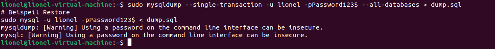

# Backup und Migration
## Begriffe
* cold Backup 
  * Sind Backups, bei denen die Daten dem User während dem Import und Export nicht zur Verfügug stehen
* warm Backup  
  * Sind Backups, bei denen die Daten dem User während dem Import und Export eingeschränkt (bwpe. nur lesend) zur Verfügug stehen
* hot Backup 
  * Sind Backups, bei denen die Daten dem User während dem Import und Export vollständig zur Verfügug stehen
* logisches Backup 
  * Das Backup steht in messbarer Form bspw. als SQL Skript zur verfüfung.
* physisches Backup 
  * Dabei stehen die Backupinformationen in Binärer Form zur Verfügung bspw. Snapshot eins Filesystems
* Point-In-Time-Restore
  * Zu jedem Zeitpuknt von jedem Zeitpunkt in der Vergangenheit zurückkehren
* Unerschied logisch und physisch
  * Physich bswp. VM Snapshot, Logisch bspw. sql dump
* full vs. incremental
  * Bei Full wird alles gesichert, dauert länger. Bei Inremental nur die Änderungen bis zum letzen Backup. Nach einem gewissen Zyklus muss auch beim Incremental ein Vollbackup passieren.

## Warmes Backup - logisch, full
Mysql dump ist ein warmes Backup weil nur Zeitweise einige Tabellen gesperrt sind. Bei diesem Vorgehen dauert ein Backup und Restore je nach dem sehr lange und alles ist sehr gross. Vorteil ist die Versions und Produktunabhänhigkeit beim Restore. Ein weiterer Vorteil, man kann die Informationen vor dem Restore überarbeiten.
```shell
# Beispiel Backup
sudo mysqldump --single-transaction -u lionel -pPassword123$ --all-databases > dump.sql
# Beispeil Restore
sudo mysql -u lionel -pPassword123$ < dump.sql
```
              
### Wieso Single transact mysqldumo?
Das Flag --single-transaction startet eine Transaktion vor der Ausführung. Anstatt die gesamte Datenbank zu sperren, lässt mysqldump die Datenbank im aktuellen Zustand zum Zeitpunkt der Transaktion lesen und sorgt so für einen konsistenten Daten-Dump.
### mydumper, myloarder
Im gegensatz zu mysqldumo kann dieses Tool parallele Verarbeitung von Datenbank, geht alles somit schneller. Die Anwendung ist analog zu mysqldump.
```shell
# Backup parallel
mydumper --compress -a
# Restore ebenfalls parallelisiert
myloader --directory dump_dir --overwrite-tables --verbose=3
```
### Skript
```shell
#!/bin/bash
# Add the backup dir location, MySQL root password, MySQL and mysqldump location
DATE=$(date +%d-%m-%Y)
BACKUP_DIR="/tmp/test-backup"
MYSQL_USER='lionel'
MYSQL_PASSWORD='Password123$'
MYSQL=/usr/bin/mysql
MYSQLDUMP=/usr/bin/mysqldump

# To create a new directory in the backup directory location based on the date
mkdir -p $BACKUP_DIR/$DATE

# To get a list of databases
databases=`$MYSQL -u$MYSQL_USER -p$MYSQL_PASSWORD -e "SHOW DATABASES;" | grep -Ev "(Database|information_schema)"`

# To dump each database in a separate file
for db in $databases; do
echo $db
$MYSQLDUMP --single-transaction --force --opt --skip-lock-tables --user=$MYSQL_USER -p$MYSQL_PASSWORD --databases $db | gzip > "$BACKUP_DIR/$DATE/$db.sql.gz"
done

# Delete the files older than 10 days
find $BACKUP_DIR/* -mtime +10 -exec rm {} \;
```
## "Cold Backup" - physisch, full oder inkrementell
Bei dieser Methode kopieren wir einfach die DB Dateien weg
```shell
rsync -avz /var/lib/mysql/* /IRGENDEINANDERSVERZEICHNIS/ 
# oder primitver:
cp -ar /var/lib/mysql/* /IRGENDEINANDERSVERZEICHNIS/ 
```
Windows Version:
```
Robocopy  D:\dir1\data E:\backup\data
```
            
Der Nachteil ist, dass die User den DB Server nicht nutzen können. Die Backups sind relativ klein und es geht schnell. Nachteil ist, dass der Restpore entweder geht oder nciht. Vorteil: Daten im RAM werde auch gesichert. Weiterer Nachteil: Ein bestimmter Zeitpunkt lässit sich nicht wiederherstellen.
### Percona XtraBackup (Bei physischen BKP interessant)
```shell
# Einfacges Bakup
xtrabackup --backup --parallel 4 --compress --target-dir /var/backup/
# Ein Backupfile
xtrabackup --backup --parallel 4 --stream=xbstream > mybackup.xbstream
OR
xtrabackup --backup --stream=tar > mybackup.tar

# Resore
# Prepare the backup
xtrabackup --prepare --parallel 4 --use-memory 4G --target-dir /var/backup

# Copy backup to original location (ie: /var/lib/mysql), assuming backup taken on same host
xtrabackup --copy-back --target-dir /var/backup

# Fix file permissions if necessary
chown -R mysql:mysql /var/lib/mysql

# Start MySQL
systemctl start mysql
```
## Point in Time Restore (Inkrementell)
Backup Vorgenen: 
1. Regelmässig Full-Backup erstellen
2. Die Änderungen auf der Datenbank zwischen den Backups gesondert sichern

Restore:
1. Zeitpunkt für die Wiederherstellung finden
2. Letztes Full-Backup vor des Wiederherstellung-Zeitpunktes einspielen (Dump)
3. Alle Änderungen zwischen dem Full-Backup um dem Wiederherstellung-Zeitpunktes einspielen

### Aktivieren / Wiederherstellung PITR
Dafür muss die Binären MySQL Logdateien aktiviert sein. Nun kann ich mir in der Logdatei immer den Entsprechenden Zeitpunkt raussuchen, da jetzt alles geloggt wird.
```editorconfig
# Im Abschnitt mysqld die Server-ID setzen
[mysqld]
 server_id=master-01
 log-bin=mysql-bin

# Optionen
expire_logs_days = 10
max_binlog_size = 100
```
Restore:
```shell
# Variante 1 : Suchen der relevaten Binär-logs und Konvertierung in Menschenlesbarer Form:
mysqlbinlog mysql-bin.010310 > mysql-bin.010310.sql

# Variante 2 : Bin-Log bis zu einem bestimmten Datum "abschneiden"
mysqlbinlog \
    --stop-datetime = ’2021-04-29 17:20:00’ \
    mysql-bin.010313 > mysql-bin.010310.sql

# Import wie gehabt
mysql --user=root -password < mysql-bin.010310.sql
```
## Migration von Daten
Migrationen kann man wie beim Backup Physisch oder Logisch durchfühen. Die Vor und Nachteile bleichen geleich:
* Physisch
  * PRO: Schnell, platzsparend, einfach
  * Con: nicht fehlertolerant
* Logisch
  * Pro: Struktur vorhanden, lesbar und veränderbar, lässit Migration auf andere Server-Versionen/Produkte zu
  * Con: gross und langsam
### Einfach