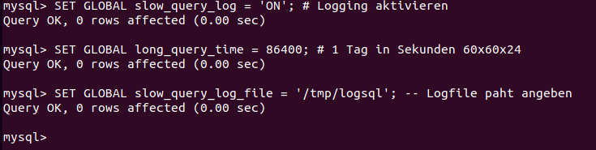
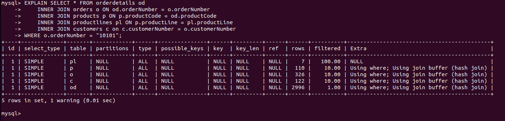
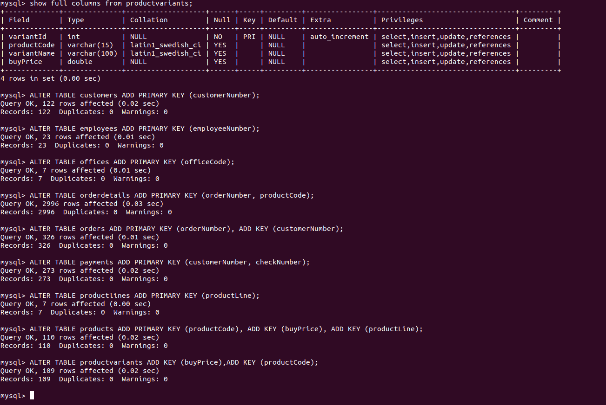
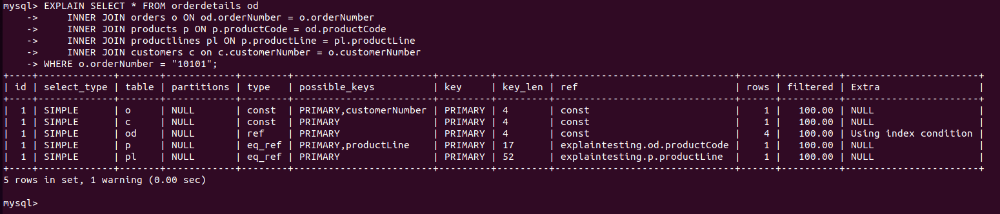

# Best Practices bei SQL-Queries / Explain
## Kurzzusammenfassung zu den Performance Tips
### Query Logging:
MySQL bietet die Möglichkeit Quries über einen bestimmten längeren Zeitraum durchgehend zu loggen:
Syntax:
```sql
SET GLOBAL slow_query_log = 'ON'; # Logging aktivieren
SET GLOBAL long_query_time = X; # Dauer wird in Sekunden angegeben
SET GLOBAL slow_query_log_file = '/path/to/filename'; -- Logfile paht angeben
```
Beispiel:
```sql
SET GLOBAL slow_query_log = 'ON'; # Logging aktivieren
SET GLOBAL long_query_time = 86400; # 1 Tag in Sekunden 60x60x24
SET GLOBAL slow_query_log_file = '/tmp/logsql'; -- Logfile paht angeben
```

### Performance Tipps
#### Attribute Indexieren
Alle Attribute indexieren die bei 'WHERE, ORDER BY, GROUP BY' zum Einsatz kommen, damit keine Fulltable Scanns entstehen.

Die Löung dafür ist es Indexes zu erstellen:

## Übungsdokuemntation zu Performance und Indexing
### Schlimm / Ohne Index
Sitationsanalyse von einem Querry der Joins verwendet ohne Indexing und wehere Statements verwendet. Für die Situationsanalyse wird vor den Select ein EXPLAIN angefügt um zu sehen was er macht:
```sql
EXPLAIN SELECT * FROM orderdetails od     
    INNER JOIN orders o ON od.orderNumber = o.orderNumber    
    INNER JOIN products p ON p.productCode = od.productCode     
    INNER JOIN productlines pl ON p.productLine = pl.productLine     
    INNER JOIN customers c on c.customerNumber = o.customerNumber      
WHERE o.orderNumber = "10101";
```
Ergebnis des Exlain:                                    
                         
Erkentnisse:
* type: ALL ist schlecht / Nichts indexiert
* keys: possible_keys und keys sind NULL / Es gibt kein Indexing
* Suchgrösse: 7 x 110 x 326 x 122 x 2996 = 91750822240 gescannte Elemente, da wir imemr Full Table Scans machen

### Verbessern mit Index
#### Tabellen Anpassen
Die PKs werden gesetzt und noch ein paar andere Indexes werden gesetzt welche das durchsuchen beschleunigen (productvariants hat bereits einen PK, da er auto increment verwendet):
```sql
ALTER TABLE customers ADD PRIMARY KEY (customerNumber);
ALTER TABLE employees ADD PRIMARY KEY (employeeNumber);
ALTER TABLE offices ADD PRIMARY KEY (officeCode);
ALTER TABLE orderdetails ADD PRIMARY KEY (orderNumber, productCode);
ALTER TABLE orders ADD PRIMARY KEY (orderNumber), ADD KEY (customerNumber);
ALTER TABLE payments ADD PRIMARY KEY (customerNumber, checkNumber);
ALTER TABLE productlines ADD PRIMARY KEY (productLine);
ALTER TABLE products ADD PRIMARY KEY (productCode), ADD KEY (buyPrice), ADD KEY (productLine);
ALTER TABLE productvariants ADD KEY (buyPrice),ADD KEY (productCode);
```
Output:                                         
                        
#### Select mit Index
Query:
```sql
EXPLAIN SELECT * FROM orderdetails od     
    INNER JOIN orders o ON od.orderNumber = o.orderNumber    
    INNER JOIN products p ON p.productCode = od.productCode     
    INNER JOIN productlines pl ON p.productLine = pl.productLine     
    INNER JOIN customers c on c.customerNumber = o.customerNumber      
WHERE o.orderNumber = "10101";
```
                         
Nun sehen wir, dass er beim Suchen und den Joins unsere Indexes verwendet hat.
Erkentnisse:
* type: ALL ist schlecht / Nichts indexiert
* keys: possible_keys und keys sind NULL / Es gibt kein Indexing
* Suchgrösse: 1x1x4x1x1=4 gescannte Elemente, kein Full Table Scann mehr 

#### Fazit
Indexing hat die durchsuchten Spalten auf 4 reduiziert von über 90Mio. was eine erhebliche verbesserung ist und dadutch auch die Zugriffszeit auf die DB schwindet.