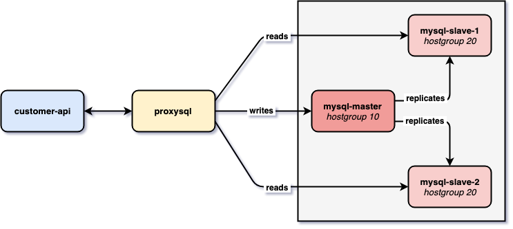

# Design von MongoDB-Schemas, Indexierung, Cluster
## Datenbankdesign Regeln
1. Favorisieren Sie Embedded Documents, ausser es gibt gute Gründe dagegen
   * Bspw. kein embedded wenn Documets zu gross werden würden wie wenn Netflix alle User in einem Group Document mit Adresse Mail usw asl Array speichern würde
2. Ist es nötig ein einzelnes Document auch einzeln anzeigen zu können, kann das ein Grund sein dieses Document nicht zu embedden
3. Versuchen Sie Joins/Lookups wann immer möglich zu vermeiden. Hilft es allerdings ein besseres(performanteres) Schema zu erreichen - arbeiten Sie mit Referenzen
   * Queries werden zu kompliziert mittels JOINS
4. Nested Arrays sollten nicht "unbegrenzt" gross werden können.
   * Man sollte nicht bei einer User Collection bei jedem User die Gruppen als Array hinzufügen und Umgekehrt. Dies verursacht serh viele Dokumenten aufrufe vorallem wenn alles in allem Mehrmals vorhanden ist. vgl. Regel 5
5. Many-To-Many - hier müssen Sie mit Referenzen arbeiten
   * Ansonsten gibt es zu viele Zugriffe -> dauer zu lange

## Übung zu Indexierung
### Vorbereitung
Zuerst wird die DB erstellt und anschliessend wird eine Funktion erstellt, welche Testdaten generiert
```mongo 
// create DB
use phones
// Funktion, um Testdaten zu generieren
    populatePhones = function(area, start, stop) {
      for(var i = start; i < stop; i++) {
        var country = 1 + ((Math.random() * 8) << 0);
        var num = (country * 1e10) + (area * 1e7) + i;
        var fullNumber = "+" + country + " " + area + "-" + i;
        db.phones.insert({
          _id: num,
          components: {
            country: country,
            area: area,
            prefix: (i * 1e-4) << 0,
            number: i
          },
          display: fullNumber
        });
        print("Inserted number " + fullNumber);
      }
      print("Done!");
    }
```
Output:                                  
       
### Daten generieren
Zuerst werden die Daten mithilfe der Funktin erstellt, welche vorhnin hinzugefügt wurde. Der zweite und die dritte Paramter geben den Range in der for Funktion an. Der erste Parameter wird verwendet, um die ID der Telephonnummer zu erzeigen und ist ein Teil der Telephonenummer. Das i in der Forschleife ist ebenfalls Teil der ID und Nummer. country ist eine zufällige Zahl. DIe Nummer setzt nun aus country area und dem aktuellen durschlauf der Funtkin zusammen. Die ID ist die Summe aus den Countrys mal 1e10 und area mal 1e7 plus dem aktuellen durchlauf.
```mongo
// Daten generieren
populatePhones(800, 5550000, 5650000) 
```
Output:                                  
                     
Der Erfolg wird mit einem einfachen find ausgeführt
```monog
db.phones.find().limit(2)
```
Output:                                  
                
### Indices auslesen
Mit Nachfolgendem Befehl werden alle Indices aller bestehender Collections aus dieser DB ausgelesen
```mong
db.getCollectionNames().forEach(function(collection) {
     print("Indexes for the " + collection + " collection:");
     printjson(db[collection].getIndexes());
});
```
Output:                                  
               
### Austesten
Performancetest anhand der Ausführungsdauer ohne Index
```monog
db.phones.explain("executionStats").find({display: "+1 800-5650001"})
```
Output:                                  
                
Aktuell haben wir 100000 Durchsuchte Dokumente (totalDocsExamind) und das dauerte 40 Millisekunden (executionTimeMillis). Der Typ des Cans (stage) war ein COLLSCAN                      
### Index erfassen
```monog
// Inex erstellen
db.phones.createIndex(
  { display : 1 },
  { unique : true, dropDups : true } // damit es unique ist werden Dulikate gedroppt
)
// Performance Test 2
db.phones.explain("executionStats").find({display: "+1 800-5650001"})
```
Output:                                  
                      
Nun wurden 0 Dokumente durchsucht (totalDocsExamind) und die Dauer wurde auf 2ms verkürzt (executionTimeMillis). Der Typ des Scans (stage) ist nun FETCH
## Übung Sharding und Replication
### Replication
#### Vorbereitung
Es wird pro instanz ein Directory benötig
```bash
mkdir ./mongo1 ./mongo2 ./mongo3
```
Output:                                  

#### Instanzen starten
Die Instanzen müssen auf verschiedenen Ports laufen in verschiedenen Terminals
```bash
# Instanz 1
mongod --replSet book --dbpath ./mongo1 --port 27011
# Instanz 2
mongod --replSet book --dbpath ./mongo1 --port 27012
# Instanz 3
mongod --replSet book --dbpath ./mongo1 --port 27013
```
Output:                                  
           
#### Starten!
Auf einer der Instanzen anmeldes mittels mongo und folgende Befehle ausführen
```monog
// Replikation initialisieren
rs.initiate({
    _id: 'book',
    members: [
      {_id: 1, host: 'localhost:27011'},
      {_id: 2, host: 'localhost:27012'},
      {_id: 3, host: 'localhost:27013'}
    ]
})
// Status der Installation Kontrollieren
rs.status().ok
```
Output:                                  
            
#### Insert testen
Ab nun muss man sich auf den ganzen Cluster Verbinden und nicht mehr auf die einzenlnen Hosts
```bash
# Verbindung aufs Cluster
mongo mongodb://localhost:27011,localhost:27012,localhost:27013/replicaSet=book
```
Output:                                  
                         
```mongo
// Erster Insert , der Replikattionstraffic sollte ersichtlich sein in den Konsolen
db.echo.insert({ say : 'HELLO!' })
// Resultat testen
db.echo.find()
```
Output:                                  
            
#### Replikation testen
Die Befhele aus dem Insert Test haben auch noch funtkioniert nachdem einer der Nodes ausgefallen ist. Mehr als einer darf aber auch nicht ausfallen, denn ansonsten get alles nciht mehr.
Output:                                  
                         
### Sharding
Folgende Infrastruktur wird aufgebaut:                               
                     
#### Vorbereitung 1, Config Server
Vorbereitung für den Config Server des Shardings                 
```bash
#Verzeichnis für Config Server erstelen
mkdir ./mongoconfig
#Config Servrer Instanz starten
mongod --configsvr --replSet "config" --dbpath ./mongoconfig --port 27016
```
Output:                 
                
Login
```bash
# Login auf dem Config Server
mongo localhost:27016
```
Output:                 
                   
Replication initiate
```monog
rs.initiate()
```
Output:                 
                  
#### Vorbereitung 2, Shards einrichten
Verzeichnise für die Shard Server erstellen und die Serverinstanze starten in verschiedenen Terminalss
```bash
mkdir ./mongo4 ./mongo5
```
```mongo
mongod --shardsvr --replSet "shard1" --dbpath ./mongo4 --port 27020
mongod --shardsvr --replSet "shard2" --dbpath ./mongo5 --port 27021
```
Output:                 
                  
#### Shards intialisieren
Pro Shard muss nun die Nachfolgende initialisierung durchgeführt werden
```bash
# Shard 1
mongo localhost:27020
rs.initiate()
# Shard 2
mongo localhost:27021
rs.initiate()
# Status kontrolieren
rs.status()
```
Output:                 
               
#### mongos (der Query Router)
Neue instanz, die sich mit dem Config Server verbindet
```bash
mongos --configdb config/localhost:27016 --port 27025
```
Output:                 
                  
#### Shards hinzufügen
Verbindeun mit dem Router, dann die Shared hinzufügen und den Status abfragen                      
```bash
# Verbindung
mongo localhost:27025
# Shards hinzufügen
sh.addShard("shard1/localhost:27020")
sh.addShard("shard2/localhost:27021")
# Stauts abfragen
sh.status()
```
Output:                 
                 
#### Sharding einführen und testen
Nun wird festgelegt wie das Sharding angewendet werden soll:
```mongo
// Auf der DB population wird sharding aktiviert
sh.enableSharding("populations")
// In der DB wird die Collection cities auf die Shards verteilt dafür wird country gehasht
sh.shardCollection("populations.cities", { "country": "hashed" })
```
Output:                 
                   
#### Daten hinzufügen
Nun werden Daten hinzugefüt und die DB erstellt
```mongo
use populations

db.cities.insertMany([
  {"name": "Seoul", "country": "South Korea", "continent": "Asia", "population": 25.674 },
  {"name": "Mumbai", "country": "India", "continent": "Asia", "population": 19.980 },
  {"name": "Lagos", "country": "Nigeria", "continent": "Africa", "population": 13.463 },
  {"name": "Beijing", "country": "China", "continent": "Asia", "population": 19.618 },
  {"name": "Shanghai", "country": "China", "continent": "Asia", "population": 25.582 },
  {"name": "Osaka", "country": "Japan", "continent": "Asia", "population": 19.281 },
  {"name": "Cairo", "country": "Egypt", "continent": "Africa", "population": 20.076 },
  {"name": "Tokyo", "country": "Japan", "continent": "Asia", "population": 37.400 },
  {"name": "Karachi", "country": "Pakistan", "continent": "Asia", "population": 15.400 },
  {"name": "Dhaka", "country": "Bangladesh", "continent": "Asia", "population": 19.578 },
  {"name": "Rio de Janeiro", "country": "Brazil", "continent": "South America", "population": 13.293 },
  {"name": "São Paulo", "country": "Brazil", "continent": "South America", "population": 21.650 },
  {"name": "Mexico City", "country": "Mexico", "continent": "North America", "population": 21.581 },
  {"name": "Delhi", "country": "India", "continent": "Asia", "population": 28.514 },
  {"name": "Buenos Aires", "country": "Argentina", "continent": "South America", "population": 14.967 },
  {"name": "Kolkata", "country": "India", "continent": "Asia", "population": 14.681 },
  {"name": "New York", "country": "United States", "continent": "North America", "population": 18.819 },
  {"name": "Manila", "country": "Philippines", "continent": "Asia", "population": 13.482 },
  {"name": "Chongqing", "country": "China", "continent": "Asia", "population": 14.838 },
  {"name": "Istanbul", "country": "Turkey", "continent": "Europe", "population": 14.751 }
])
```
Output:                 
                
#### Kontrolle
Nun kann man mit Nachfolgendem Befehl die Statisken der Shards anzeigen lassen:
```monog
db.cities.getShardDistribution()
```
Output:                 
                              
#### Anwendung
Ein normaler find ist jetzt über das Routing ganz einfach. Der Router übernimmt die Cluster von alleine. Mit explian kann das analysiert werden
```mongo
db.cities.find().explain()
```
Output:                 
                  