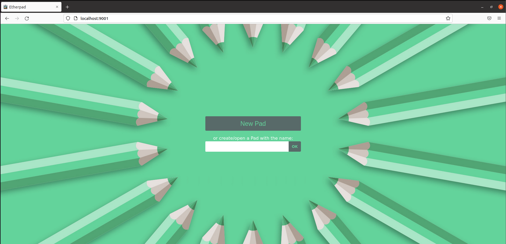

# Etherpad und Security
## Installation
### Installation Nodejs und npm
Etherpad läuft mit Javascript/typescript und deshalb muss das Runtimeenvironment installiert werden:
````shell
# Infrastruktur vorbereiten
curl -sL https://deb.nodesource.com/setup_14.x | sudo -E bash -

# Pakete installieren
sudo apt install -y nodejs
````
Output:                                
                                  
                             
### Git Clone
Applikation von Github holen
```shell
git clone --branch master https://github.com/ether/etherpad-lite.git
cd etherpad-lite
```
Output:                      
                              
### Datenbank vorbereiten (MySQL)
```shell 
mysql -u root -ppassword
```
```sql
create database `etherpad_lite_db`;
CREATE USER 'etherpad'@'localhost' identified by 'Hallo123$';
ALTER USER 'etherpad'@'localhost' IDENTIFIED WITH mysql_native_password BY 'Hallo123$';
grant CREATE,ALTER,SELECT,INSERT,UPDATE,DELETE on `etherpad_lite_db`.* to 'etherpad'@'localhost';
```
Output:
               
### Etherpad Settings
```shell
# Kopieren vom Config-File
cp settings.json.template settings.json
nano settings.json
```
Im File angepasst
```json
"dbType" : "mysql",
"dbSettings" : {
    "user"    : "etherpad",
    "port"    : "/var/run/mysqld/mysqld.sock",
    "password": "Hallo123$",
    "database": "etherpad_lite_db",
    "charset" : "utf8mb4"
}
```
### Etherpad Plugin Install
Zusätzliche Plugins installieren
```shell
# Befehl in Etherpad-Folder ausführen
npm install --no-save --legacy-peer-deps ep_headings2 ep_markdown ep_comments_page ep_align ep_font_color ep_webrtc ep_embedded_hyperlinks2
```

### Etherpad starten
```shell
# Im Etherpad Folder ausführen
src/bin/run.sh
```
                                                 
Zugriff via http://localhost:9001                        
         
## Testing und Daten
### Testing
   
### Daten
Die Daten werden alle in einer Tabelle gespeichert und danach werden bei den Keys einfach nur die Namen der PADs gespeichert + welcher aufruf. Bei den Usern wird auch bei den Keys gepeichert. Bei den Daten sind einfach JSON Werte vorhanden wie der author bei den Pads und bei den autoren steht bspw. deren farbe.  
                                      
            
Die Daten werden nicht gelich als JSON gespeichert sondern jedes PAD hat eine ID und wenn bspw. ein Chat erstellt wird wird dieser einfach nachnummeriert
## Security-Angriffsvektoren
Diese Applikation ist eingermassen sicher, denn der Zugriff auf die Datenbank erfolgt nur über den Localhost (Der Client hätte aber die möglichkeit über Javascript irgend einen blödsinn in die DB einzufügen), es werden aber keien Storesd Procedures verwendet, zudem wird ein user verwendet, der nur auf die etherpad db zugriff hat. Leider verwendet Ehterpad auch keine Verschlüsselung weshalb alle Werte die an den Server gesendet werden einsehbar sind bevor die Webapplikation diese in die DB schreibt. Die Werte werden jedoch immer als Strings eingefügt was SQL Injections deutlich erschweren. Die Datenbank ist nur über Localhost erreichbar und Javascript über den Webserver. Leider sind auch die Daten in der Datenbank nicht gehasht, auch die Chats nicht.

Insegast würde ich sagen, dass die Applikation nicht sehr schön ist aber eine Note 4 also genügend bezüglich Sicherheit erhalten würde. 