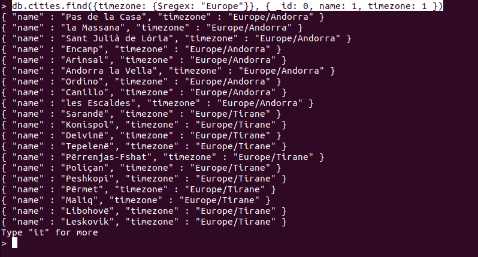
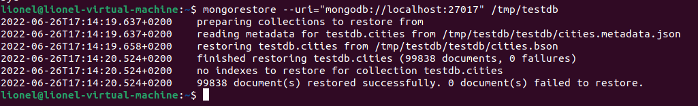

# Import/Export/Backup/Restore und Queries
## Import
Der Syntax beim Import sieht wie folgt aus:
```bash
mongoimport --uri="mongodb://mongodb0.example.com:27017/reporting"  --db=users --collection=contacts --file=contacts.json
```
### Mode Options
Beim Importieren kann eingestellt werden, dass falls ein Dokument mit der seleben ID bereits exisitert dieses erstzt wird mit folgendme Parameter:
```bash
--mode=upsert
```
Beim Import können aber auch Inhalte von Dokumenten mit der sleben ID gemergt werden mit dem Parameter:
```bash
--mode=merge
```
Die dritte möglichkeit ist dass falls ein Dokument mit selber ID bereits existiert dieses gelöscht wird:
```bash
--mode=delete
```
### JSON Version
MongoDB versucht grundsätzlich zu erkennen in welcher Version von JSON diese Datei ist. Da man dies aber nicht dem Zufall überlasssen sollte kann man die Version wie folgt forcieren:
```bash
--jsonFormat=canonical : Extended JSON v2.0 (Canonical mode)
keine Angabe : Extended JSON v2.0 (Relaxed mode)
--legacy : Extended JSON v1.0
```
### Command für die Übung
```bash
mongoimport --uri="mongodb://localhost:27017"  --db=testdb --collection=cities --file=Downloads/mongo_cities1000.json --legacy
```
Output:                                  
                         
## Queries
Alle Städte aus der Zeitzone Europe kann ich wie folgt ausgeben:
```mongo
db.cities.find({timezone: {$regex: "Europe"}}, { _id: 0, name: 1, timezone: 1 })
```
Output:                                  
                        
## Aggregate an einem Beispiel
Aggeregate ermölicht es Werte über mehrere Dokumente zu gliedern, im Untenstehenden fall wurde die Summe aller Einwohner ausgegeben, welche sich in der Zeitzone London befinden
```mongo
> db.cities.aggregate([
    {
    $match: {
        'timezone': {
        $eq: 'Europe/London'
        }
    }
    },
    {
    $group: {
        _id: 'averagePopulation',
        avgPop: {
        $avg: '$population'
        }
    }
    }
])
```
Output:                                  
                
## Sort an einem Beispiel
Im Nachfolgenden Beispiel werden mehrere Dokumente durchsucht, welche die Zeitzone London enthalten und nach der Städte grösse von Oben nach unten sortiert, es wird eingestellt, dass nur der Name und die Einwohnerzahl ausgeben wird.
```mongo
db.cities.aggregate([
    {
    $match: {
        'timezone': {
        $eq: 'Europe/London'
        }
    }
    },
    {
    $sort: {
        population: -1
    }
    },
    {
    $project: {
        _id: 0,
        name: 1,
        population: 1
    }
    }
])
```
Output:                                  
                 
## Backup und Restore einrichten und durchführen
## Backup
```bash
mongodump --host=localhost --port=27017  --db=testdb --out=/tmp/testdb
# Mit archiv
mongodump --host=localhost --port=27017  --db=testdb --out=/tmp/testdb.archive
```
Output:                                  
                 
## Restore
```bash
mongorestore --uri="mongodb://localhost:27017" /tmp/testdb
# Al Archive
mongorestore --uri="mongodb://localhost:27017" /tmp/testdb.archive
```
Output:                                  
               
### Syntax Simultanes Backuo
```bash
mongodump --archive --db=test | mongorestore --archive --nsFrom='test.*' --nsTo='examples.*'
```
## Export Syntax
```bash
# Auch hier sollte die JSON Version angeben werden
# Host und Port separat angeben
mongoexport --host="mongodb0.example.com" --port=27017 --collection=events --db=reporting --out=events.json [additional options]
# Uri
mongoexport --uri="mongodb://mongodb0.example.com:27017/reporting"  --collection=events  --out=events.json [additional options]
```
### Export Filter
Mit dem Parameter -q kann man filtern
```bash
mongoexport --collection=events --db=reporting -q='{ "a": { "$gte": 3 }, "date": { "$lt": { "$date": "2016-01-01T00:00:00.000Z" } } }' --out=myRecords.json
```