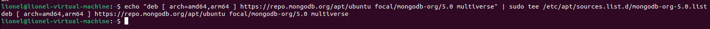

# Installation MongoDB
## Recherche zu MongoDB
Es ist wichtig sich vor der Installation über das Produkt zu informieren, um abhängikeiten oder inkompatibilitäten zu gewissen Betriebssystemen oder anderen Programmen festzustellen und diese zeitnah zu beheben.
### Hersteller
MongoDB wird durch MongoDB, Inc. entwickelt und als Open Source Software bereitgestellt.
### Lizenzen
MongoDB ist kostenlos und eine Open Source Software. Es ist jedoch möglich eine kostenpflichtige Enterprise Advanced Version zu erwerben oder Fertige Cloud Server auf AWS, Azure oder GCP. Die genauen Lizenzinforamtionen sind hier ersichtlich: [MongoDB Licensing](https://www.mongodb.com/community/licensing)                            
### Support
MongoDB bietet einen komerziellen Support, welcher mit einem Kauf von bestimmten Lizenzen und einem Account verfügbar ist. MongoDB bietet auch Trainings und Consulting an. Wer dies nichts davon besitzt oder in Anspruch nimmt ist auf die gute Doku von MongoDB und Foren angewiesen.                           
Informationen über den Support findet man hier: [MongoDB Support](https://support.mongodb.com/?_ga=2.167341757.264540531.1655058480-1401764080.1655058480)                     
Hier findet man das Manual mit allen Support Links [Support Links und Manual](https://www.mongodb.com/docs/manual/support/)
### Software (Features/Releasezyklen/...)
#### Features
1. Jede Datenbank besteht aus Collections in welcher wiederum Documents abgelegt sind. Jedes Document kann dann wiederum aus verschiedenen Fields bestehen. Jedes Document kann unterschiedlich gross sein.
2. Die Struktur von einem Document ist typischerweise "eher etwas näher an der Struktur von Programmiersprachen"
3. Die Documents müssen in ihrer Struktur nicht vordefiniert werden
4. Man kann ein Datenmodel mit hierarchischen (strukturierten) Daten ablegen. Man kann auch Arrays direkt speichern
5. Skalierbarkeit : MongoDB ist sehr skalierbar (war ja per Definition ein Designziel). Es gibt Beispiele von Clusters mit mehreren hundert Nodes mit jeweils mehreren Millionen Documents

                    

#### Releasezyklen
Bei MongoDB erscheint normalerweise Jährlich ein neuer Release. Dieser Release erhält dann ca. 3-4 Jahre Support. Die aktuelle stable Version, 5.0, hat Support bis Oktober 2024. Hier findet man die alles über den Support der einzelnen Versionen: [MongoDB Software Lifecycle Schedules](https://www.mongodb.com/support-policy/lifecycles)                   
#### Neuster Release
Der neuste verfügbare stable Release ist MongoDB 5.0.9. Weitere Informationen zu den einzelnen Releases und der Versionierung findet man unter: [Release Notes](https://www.mongodb.com/docs/manual/release-notes/)
## Voraussetzungen der Installation (VM)
### Aus welcher Quelle installieren Sie Ihre Software?
Die Software wird durch den Ubuntu packet manager installiert, nachdem der Update-Link von MongoDB registiert wurde 
### In welcher Version installieren Sie Ihre Software (und deren Abhängigkeiten)?
* MongoDB wird in der Version 5.0.9 installiert

Abhängikeiten:
Eine Liste mit den Abhängikeiten von MongoDB in der Community Edition findet man hier: [Abhängigkeiten](https://www.mongodb.com/docs/manual/tutorial/install-mongodb-on-ubuntu/#mongodb-community-edition-packages)                        
Diese Abhängikeiten werden installiert:
* mongodb-database-tools
* mongodb-mongosh
* mongodb-org
* mongodb-org-database
* mongodb-org-database-tools-extra
* mongodb-org-mongos
* mongodb-org-server
* mongodb-org-shell
* mongodb-org-tools

## Prozess der Installation (Wie/Was habe ich es installiert?)
### Welche Software (inkl. Abhängigkeiten) wird installiert? Welche Version?
Installiert wird MongoDB 5.0.9
Die Abhängigkeiten sieht man während der Installation bevor man mit y bestätigt
* mongodb-database-tools 
* mongodb-mongosh 
* mongodb-org 
* mongodb-org-database 
* mongodb-org-database-tools-extra 
* mongodb-org-mongos 
* mongodb-org-server 
* mongodb-org-shell 
* mongodb-org-tools


### Ablauf der Installation (dokumentiert über Printscreens) + Beschreiben Sie einzelnen Installationsschritte und Entscheidungen die Sie getroffen haben
1. Hinzufügen des Update Link:                                
```bash
wget -qO - https://www.mongodb.org/static/pgp/server-5.0.asc | sudo apt-key add -
```
Output:                       
                             
- Falls ein Fehler erscheint, dass der Key nicht importiert werden kann muss zuerst folgender Befehl ausgeführt werden um gnupg zu installieren:                        
    ```bash
    sudo apt-get install gnupg
    # Danach noch einmal den Update Link hinzufügen
    ```                           
2. Update Source erfassen:
```bash
echo "deb [ arch=amd64,arm64 ] https://repo.mongodb.org/apt/ubuntu focal/mongodb-org/5.0 multiverse" | sudo tee /etc/apt/sources.list.d/mongodb-org-5.0.list
```
Output:                  

3. Source aktualisieren
```bash
sudo apt update
```
Output:                            

4.MongoDB installieren 
```bash
sudo apt-get install -y mongodb-org
```
Output:                            
               
## Test der Installation
Das Testen einer Installation ist essentziell, damit frühzeitig festgestellt wird, wenn eine Installation fehlerhaft ist.
### Dienste
Mit dem Nachfolgenden Befehl habe ich den Status des Dienstes abgefragt:         
```bash
sudo systemctl status mongod.service
```
Output:                            
        
### Verbindungstest
Mit dem Nachfolgenden Befehl kann ich mich Verbinden:
```bash
mongo
```
Output:                            
             
### Installiere DBs
Nachfolgender Befehl zeigt alle DBs auf dem Server an
```mongo
show dbs;
```
Output:                            
                       
### Installierte User
Die installierten USer kann man über die admin DB anzeigen mit nachfolgenden Befehl
```mongo
use admin
show users;
```
Output:                            
                   
### Version
Mit nachgfolgendem Befehl kann ich mir die aktuell verwendete MongoDB Version anzeigne           
```monog
db.version()
```
Output:                            
            
### DB und Collection erstellen
Diese Infos findet man hier [Erstellen Sie eine Datenbank Ihrer Wahl](http://localhost:10000/#/InstallationMongoDB/?id=erstellen-sie-eine-datenbank-ihrer-wahl)                         
## Dokumentation zur Übung "Erste Schritte mit MongoDB"
Die MongoDB Shell wird mit dem Befehl ```mongo``` gestartet
### Erstellen Sie eine Datenbank Ihrer Wahl
Mit dem ```use``` befehl wird bei MongoDB nicht nur eine Datenbank ausgewählt, Sie wird auch erstellt, falls Sie nicht vorhanden ist                           
Beispiel:
```mongo
use cities;
show dbs; // zeigt alle DBs uf dem server an
show databases; // zeigt alle verfügbaren Datenbanken an
db; // Prüft welche db aktuell ausgwählt ist
db.dropDatabase(); // nach use dbname ausfhren
```
Output:                                  
                            
### Erstellen Sie eine Collection in Ihrer Datenbank
mit dem Befehl db.createCollection() kann man Collections erstellen
```mongo
db.createCollection(<name>, { options } ) // Syntax
db.createCollection ("meinecollection", { capped: true,
        size: 6142800,
        max: 10000 } ); // Size und max grösse ist in bytes, capped beschränkt die grösse ist alles Optional
db.collection.drop()
```
Output:                                  
                                 
### Fügen Sie Dokumente in Ihrer Collection hinzu, suchen Sie sie und löschen Sie sie
```monog
# Insert
.insertOne()
.insertMany()
.insert()
# Monog macht automatisch eine Unique ID
db.meinecollection.insertOne(
{
    Name: "Name",
    Alter: 28,
    Geschlecht: "männlich"
})
# Suchen
db.meinecollection.find( { Name: "Name", Alter: 28 } ) // es gibt auch noch query filter (Abfragefilter) und projection (Spezifikation des Anzeigeergebnisses)
# Update
db.meinecollection.update(
{ Alter: 28 },
{
$set: { Alter: 30 }
})
# Delete
db.meinecollection.remove ()
db.meinecollection.remove ( { Alter: 28 } )
db.meinecollection.remove ( { Alter: 28 }, 1 ) // löscht nur einen
```
Output:                                  
                           
### Installieren Sie ein GUI-Client-Programm um auf MongoDB zuzugreifen und testen Sie die Software aus
Ich habe mich für für Stuido 3T entschieden und finde es super programm, da es an mysql GIU Programme erinntert. Zudem kann man auch Migrationen durchführen, Select update Insert Delete vorgänge erledingen und auch Collections wie DBs erstellen. Es erfüllt alles was man für die Verwaltung einer Datenbank braucht. Die Installation besteht aus einer Shell was es ebenfalls recht einfach macht. Schade ist, dass die Vollversion nur 30 Tage gültig ist. WEitere Informationen findet man unter folgendem [Link](https://studio3t.com/)               
Output:                                  
              
## Dienste
### Handling
```shell
# mongodb starten
sudo systemctl start mongod
# mongodb stoppen
sudo systemctl stop mongod
# mongodb neu starten
sudo systemctl restart mongod
# mongodb status abfragen
sudo systemctl status mongod
# Dienst anzeigen
sudo systemctl --type=service # Alle
sudo systemctl --type=service --state=active # Nur aktive, muss nicht zwingend laufen
sudo systemctl --type=service --state=runnning # Nur laufende
```
### Autostart von MongoDB
```shell
sudo systemctl enable mongod.service # Aktiviert
sudo systemctl disable mongod.service #Deaktiviert
```
## Naming / Begriffe in MongoDB vs RDBMS
| RDBMS       | MongoDB                                                   |
|-------------|-----------------------------------------------------------|
| Database    | Database                                                  |
| Table       | Collection                                                |
| Tuple/Row   | Document                                                  |
| column      | Field                                                     |
| Table join  | Embedded Documents                                        |
| Primary Key | Primary Key (Default key _id provided by MongoDB itself)  |