# MySQL Installation
## Recherche vor der Installation
Es ist wichtig sich vor der Installation über das Produkt zu informieren, um abhängikeiten oder inkompatibilitäten zu gewissen Betriebssystemen oder anderen Programmen festzustellen und diese zeitnah zu beheben.
### Hersteller
1994 wurde MySQL von der schwedischen Firma MySQL AB entwickelt. Im Februar 2008 wurde MySQL AB durch Sun Microsystems übernommen, welches dasnn im Januar 2008 von Oracle gekauft wurde. D.h. aktuell ist Oracle der Hersteller und Betreiber von MySQL.
### Lizenzen
Für Geschäftskunden ist MySQL Kostenpflichtig und für Privatanwender kostenlos. MySQL bietet für Firmen 3 Pläne an, welche unterschiedlich viel Kosten und unterschiedliche Services und Support seitens Oracle beinhalten. Weitere Informationen findet man hier: [MySQL Produkte](https://www.mysql.com/de/products/)
### Support
Oracle bietet kostenpflichten Support an für MySQL, wer jedoch nicht bezahlen möchte ist auf das Handbuch und Foren angewiesen. Informationen zu den Support Plänen von Oracle findet man hier: [MySQL Support](https://www.mysql.com/de/support/)
### Software
#### Features
* Array als Datentyp
* Cluster ist möglich
* Hohe Konstitenz und Verfügbarkeit
* Hohe Konstitenz und Verfügbarkeit

#### Releasezyklen
Alle 2 bis 3 Jahre erscheint eine grössere neue Verison von MySQL Database.

|Release|GA Date| Latest minor version | Premiere Support Ends | Extended SUpport Ends |Substaining Support Ends|
|-------|-------|----------------------|-----------------------|-----------------------|------------------------|
|MySQL Database 5.0|Oct 2005| Not Available        | Dec 2011             | Not Available         |Indefinite|
|MySQL Database 5.1|Dec 2008| 5.1.73               | Dec 2013              | Not Available         |Indefinite|
|MySQL Database 5.5|Dec 2010| 5.5.62               | Dec 2015              | Dec 2018              |Indefinite|
|MySQL Database 5.6|Feb 2013| 5.6.51               | Feb 2018              | Dec 2021              |Indefinite|
|MySQL Database 5.7|Oct 2015| 5.7.37               | Oct 2020              | Dec 2023              |Indefinite|
|MySQL Database 8.0|Apr 2018| 8.0.28               | Apr 2021              | Dec 2026              |Indefinite|

Quelle: [Oracle](https://www.oracle.com/us/support/library/lifetime-support-technology-069183.pdf), [Wikipedia MySQL](https://en.wikipedia.org/wiki/MySQL)
#### Neuster Release
Der neueste Verfügbare Release ist 8.0.28
## Recherche zur Installationsumgebung (OS, Kernel, etc)
### Kernel mit Version und Release
Der Befehl uname wird verwendet um diverse Optionen über Kernel usw. auszugeben. Mit dem Parameter --help sieht man die einzelnen Funktionen.
```shell
uname -a #gibt alles aus
``` 
```uname -srv``` hat folendes ergeben: 
* Linux 5.13.0-39-generic #44-Ubuntu SMP Thu Mar 24 15:35:05 UTC 2022

### Hardware und OS informationen
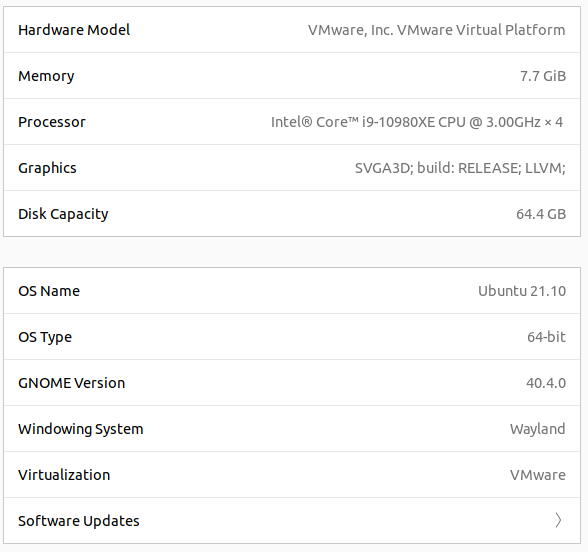
Mit dem folendem Befehl kann ich mir detailierte Releaseinformationen anzeigen lassen:
```shell
lsb_release -a
```
Output:              
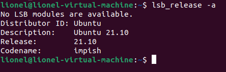
### Installations Quelle
ICh habe MySQL vom Ubuntu Packet Manager installiert.
### Version und Ihre Abhängigkeiten
* mysql-server Verion 8.0.28

Abhängikeiten:
MySQL hat sehr viele Abhänihkeiten und diese haben wieder um Abhängikeiten, eine genaue Liste findet man hier (Je nach Ubunut Version unterschiedlich):
[Abhängikeiten](https://packages.ubuntu.com/impish/mysql-server)                  
Diese werden installiert:
* libaio1 
* libcgi-fast-perl 
* libcgi-pm-perl 
* libevent-core-2.1-7 
* libevent-pthreads-2.1-7 
* libfcgi-bin libfcgi-perl 
* libfcgi0ldbl 
* libfwupdplugin1 
* libhtml-template-perl 
* libmecab2 
* libprotobuf-lite23 
* mecab-ipadic 
* mecab-ipadic-utf8 
* mecab-utils 
* mysql-client-8.0 
* mysql-client-core-8.0 
* mysql-common 
* mysql-server-8.0 
* mysql-server-core-8.0

### Andere Dienste die auf dem Server laufen
Die Dienste auf dem Server wurden wie folgt ermittelt:
```shell
systemctl –-type=service
# systemctl list-unit-files daruch werden alle Einheiten angezeift, zu viele Infos 
```
Dadurch habe ich folgende Dienste erhalteb:                               
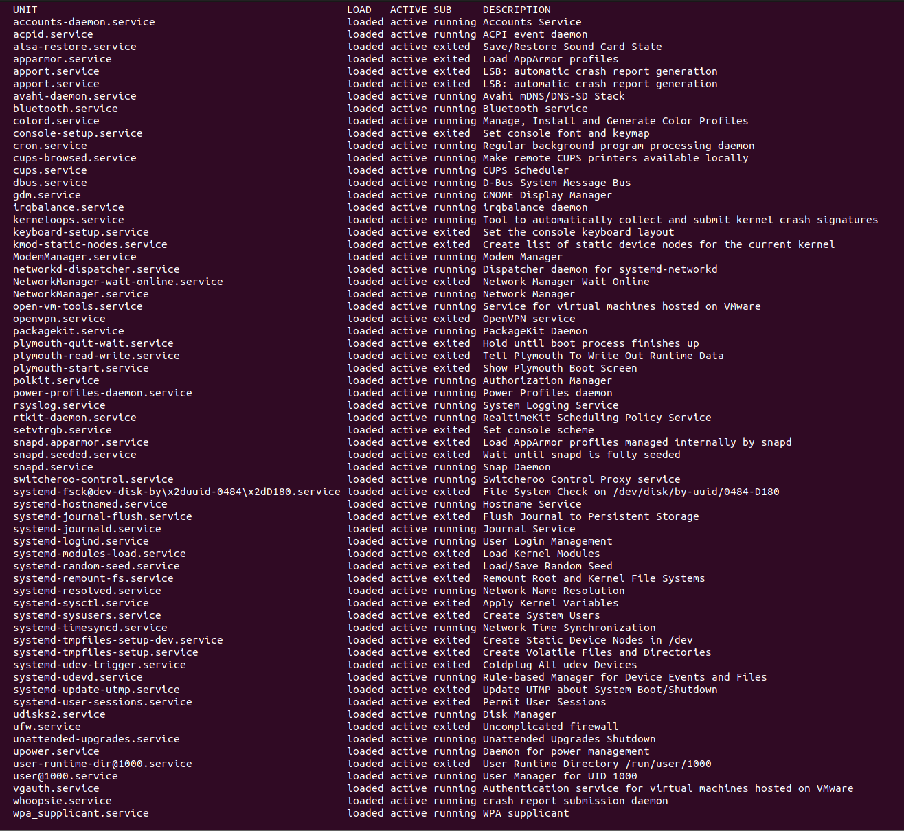
## Dokumentation des Installationsprozesses
### Zu installierende Software inkl. Abhängigkeiten und Version
Die Ahängikeiten sieht man während der Installation bevor man mit y bestätigt
* MySQL Server in der Version 8.0.28
* libaio1 
* libcgi-fast-perl 
* libcgi-pm-perl 
* libevent-core-2.1-7 
* libevent-pthreads-2.1-7 
* libfcgi-bin libfcgi-perl 
* libfcgi0ldbl 
* libfwupdplugin1 
* libhtml-template-perl 
* libmecab2 
* libprotobuf-lite23 
* mecab-ipadic 
* mecab-ipadic-utf8 
* mecab-utils 
* mysql-client-8.0 
* mysql-client-core-8.0 
* mysql-common 
* mysql-server-8.0 
* mysql-server-core-8.0

### Ablauf der Installation
1. Paketindex aktualisieren
```shell 
sudo apt update
```
Output:                           
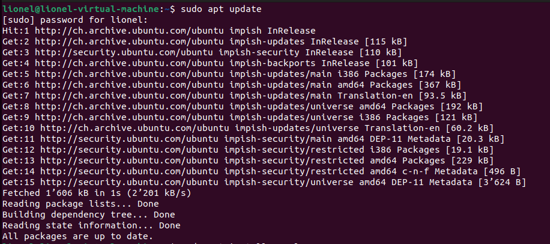
2. MySQL Server installieren
```shell
sudo apt install mysql-server -y
```
Output:                                  
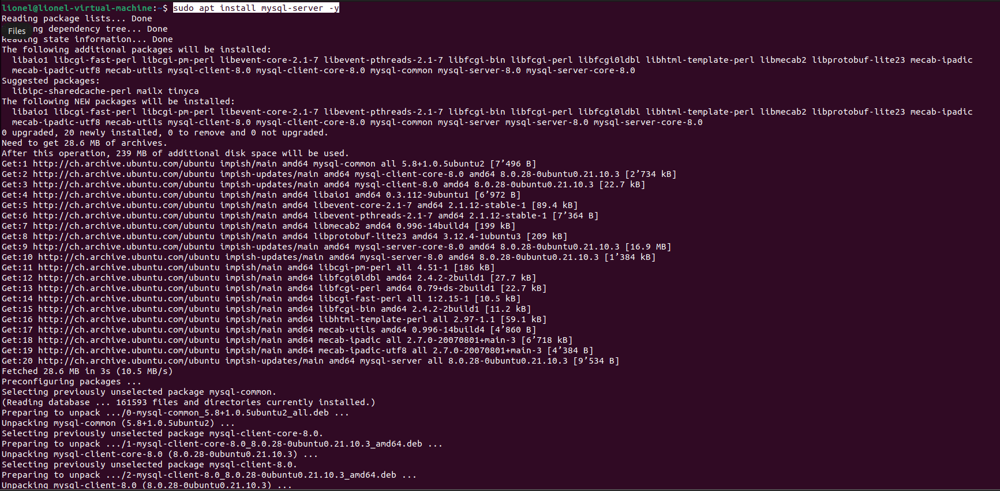
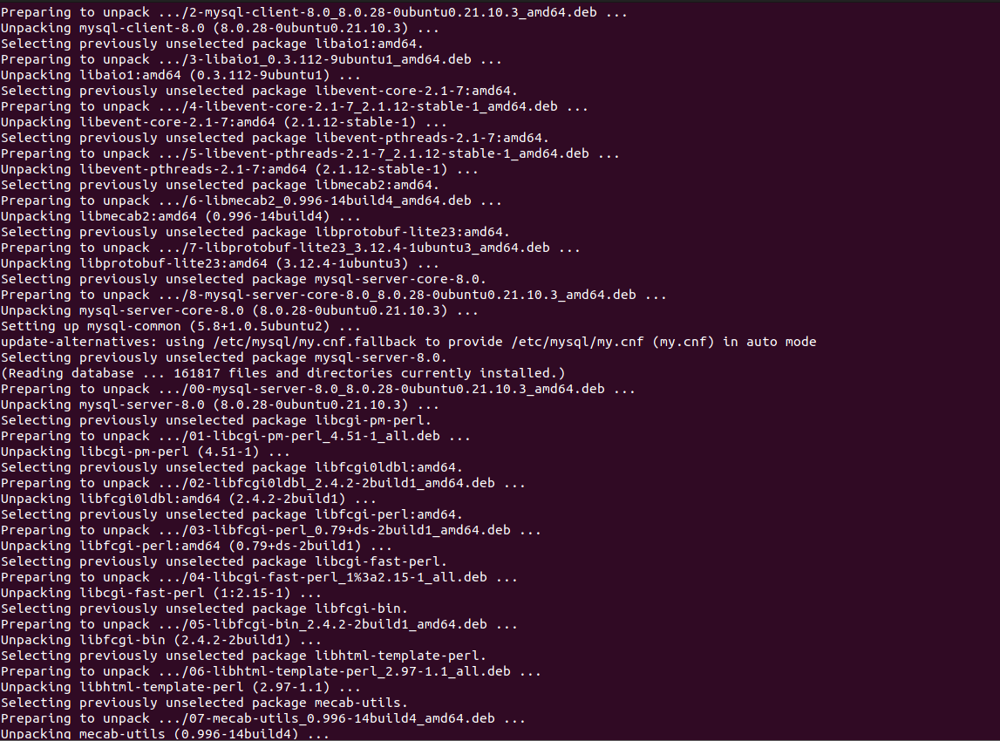
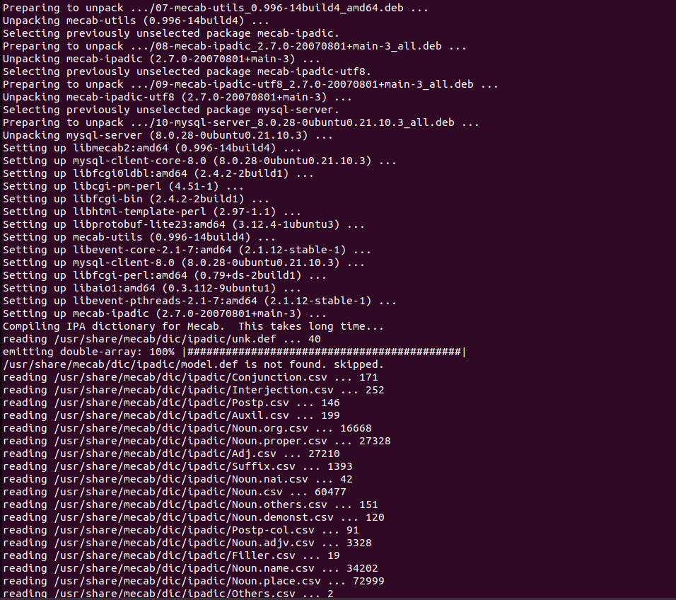
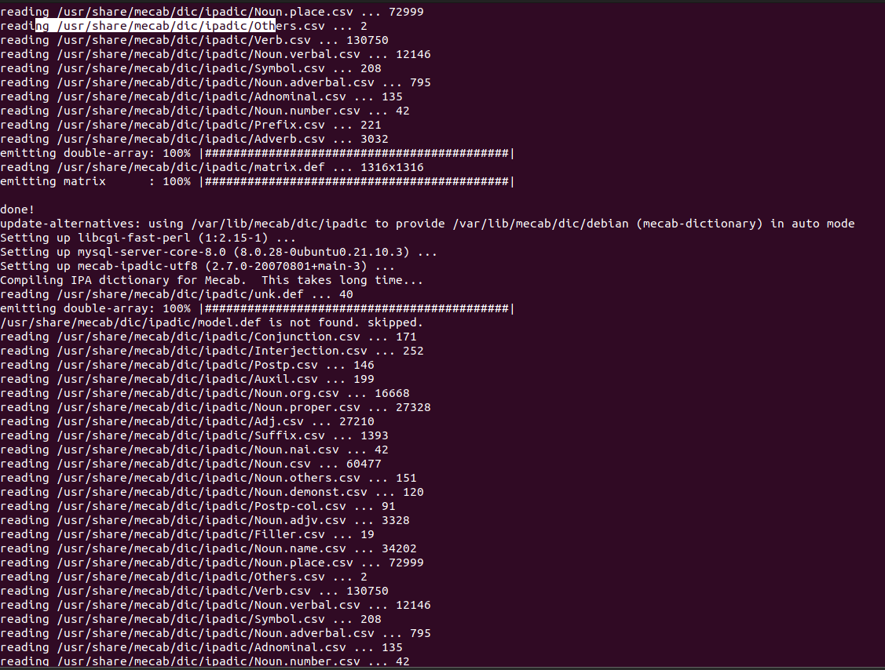
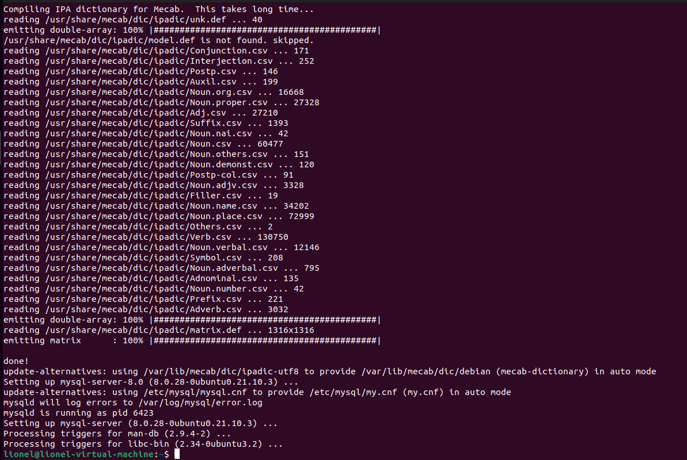
3. mysql_secure_installation
MySQL secure Installation ist ein Skript mit dem ich die durch einen Assistenten in der Konsole verschiedenen Sicherheitseinstellungen ändern kann. Dadurch werden die "offensichtlichen Sicherheitslücken" wie Test DBs und User verringert.
    - Zuerst Skript ausführen           
   ```shell
   sudo mysql_secure_installation 
   ```
   - Danach werde ich gefragt, ob ich Passworanforderungen ändern möchte, ich wähle ja                         
     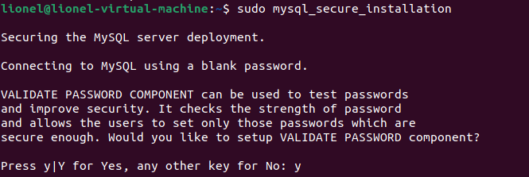
   - Danach kann ich einstellen wie Stakr, das PAsswort sein soll, ich wähle hier 0 für Schwach, in einem echten System würde ich hier 3 für Stark wählen, um die Sicherheit der Daten zu gewährleisten.                                          
     
   - Danach werde ich gefragt, das neue root Passwort zu setzen, diese muss den vorher festgelegten minimalanforderungne entsprechen. Danach muss ich bestätigen, dass ich das Passwort verwenden möchte und mir wird angezeigt wie sicher das Passwort ist.                     
   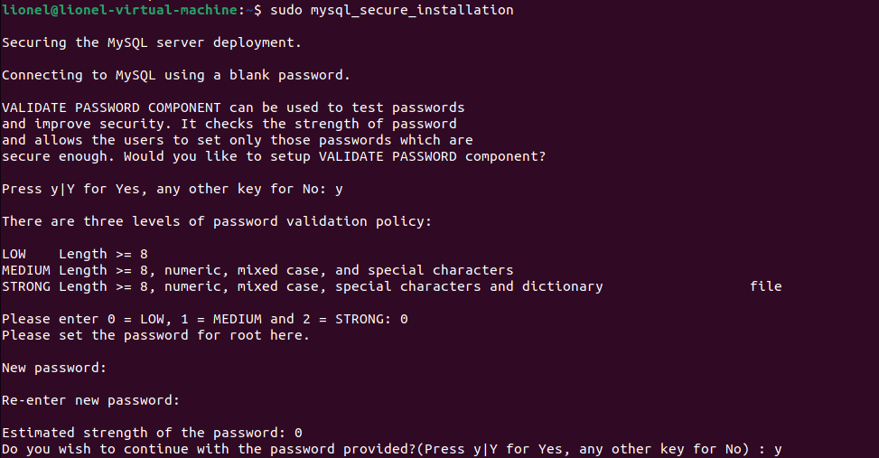
   - Nun werde ich gefragt, ob ich die anonymen User entferenen möchte, was ich mit Ja bestätige                           
   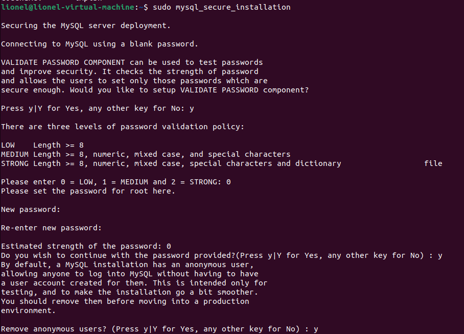
   - Nun kann ich einstellen, dass der User root nur von localhost auf das DBMS zugriff hat was ich bejahe                                   
     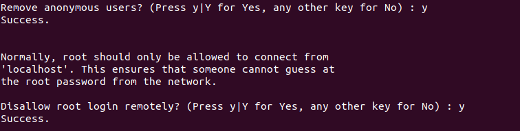
   - Nun kann ich mit y die Test DBs und deren Zugriffe entfernen, was die Sicherheit erhöht und aufräumt                                          
     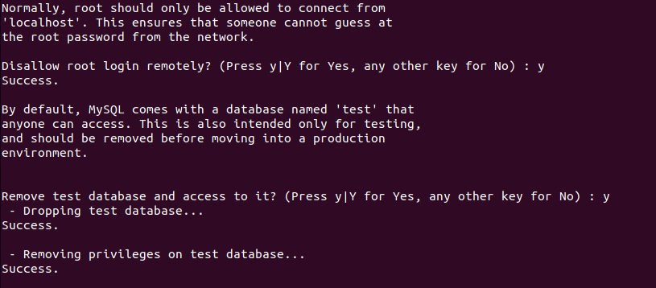
   - Nun habe ich die Möglichkeit die Berechtigungstabelle neu zu laden, was dafür sorgt, dass alle Änderungen sicher übernommen wurden                                    
     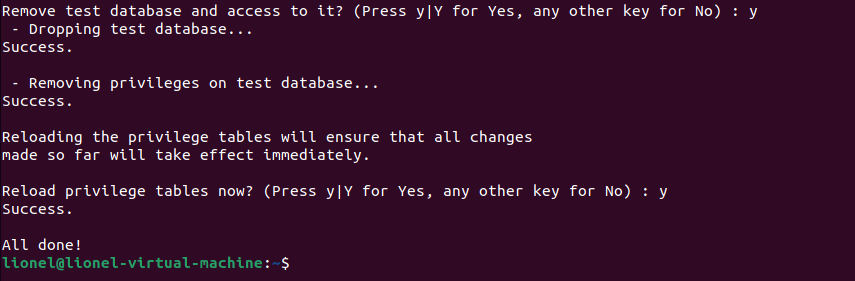
4. Root Login authentication (Optional
Der Root user benötigt normalerweise keine Passwort authentifizierung, um diese zu Konfigurieren muss ich die User Tabelle überarbeiten und Ihn mit dem Plaugin caching_sha2_password statt mit dem Plugin auth_socket zu authentifizieren 
   - Ohne Authentifiziereung                                                 
   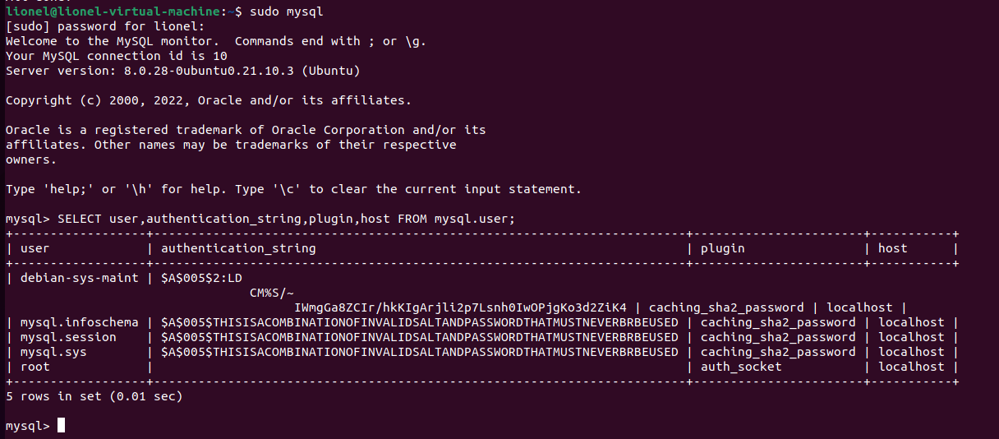
   - Mit dem nachfolgenden Befehl kann ich die PW authentifizierung aktivieren (caching_sha2_password ist der Nachfolger mit verschlüsselung vom alten mysql_native_password, jedoch haben andere Anwendungen mit dem neueren Plugin oft mehr mühe)
     ```sql
     ALTER USER 'root'@'localhost' IDENTIFIED WITH caching_sha2_password BY 'password'; 
     ```
   - Danach muss ich noch die Berechtigungen anwenden mit dem Nachfolgenden Befehel
     ```sql
     FLUSH PRIVILEGES;
     ```
     Dieser Screenshot ist mit mysql_native_password, da ich dieses später noch brauchen werde                                                
     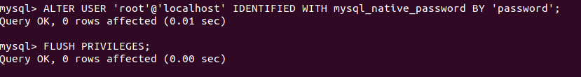                                  
   - Anschlissend muss in der Tabelle bei authentication_string ein String stehen                                                       
   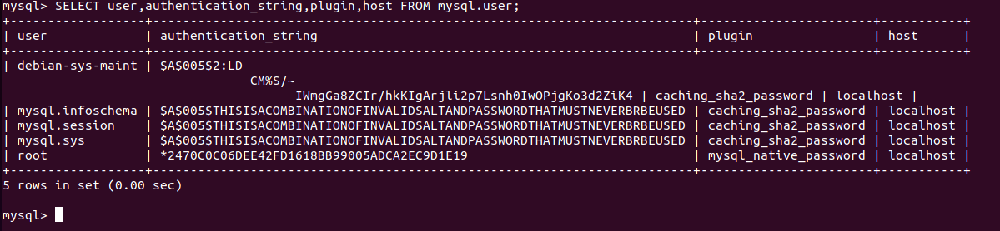          

## Testing der Installation
Das Testen einer Installation ist essentziell, damit frühzeitig festgestellt wird, wenn eine Installation fehlerhaft ist.
### Dienst
Mit dem Nachfolgenden Befehl habe ich den Status des Dienstes abgefragt:
```shell
sudo systemctl status mysql
```
Output:                                       
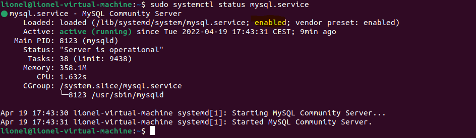                                            
Anahnd des gelb Markierten enable weiss ich, dass der Dienst automatisch startet und anhand des Grünen Punktes weiss ich dass er suaber läuft
### Verbindungstest
Mit dem Nachfolgenden Befehl habe ich mich auf das DBMS verbunden:
```shell
mysql -u root -p
```
Output:                                       
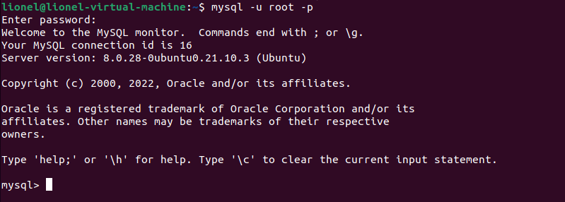
### Installierte DBs
Mit dem Nachfolgenden Befehl habe ich mich mir die existierenden DBs angezeigt:
```sql
show databases;
```
Output:                                       
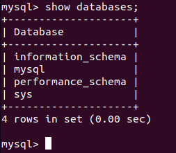
### Installierte User
Mit Nachfolgendem Befehl werden die User angezeigt;
```sql
select user from mysql.user;       
```
Output:                           
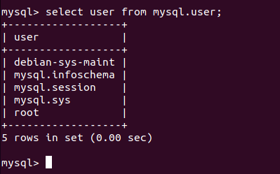

Mit diesem Befehl kann ich die einzelnen Berechtigungen der User anzeigen lassen:
```sql
SELECT * FROM information_schema.user_privileges; 
# show grants for user@host; Zeigt nur die Berechtigungen für einen einzelnen User und Host an
```
Output (Nur ein ausschnitt):              
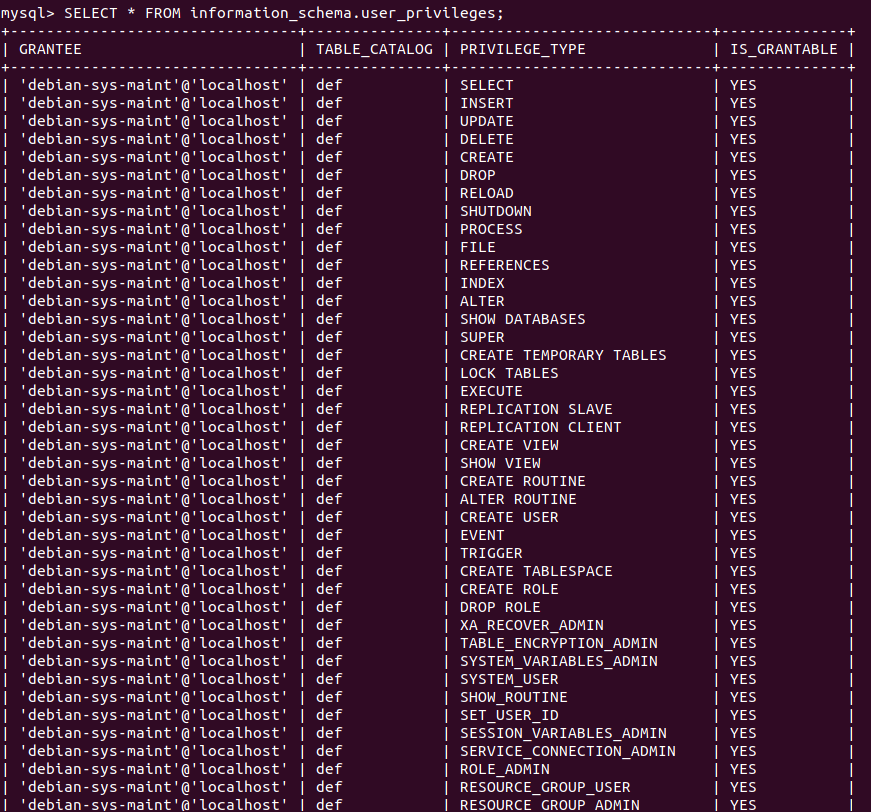
### DBMS Version 
Mit dem Nachfolgenden Befehl habe ich mich mir die Verison des DBMS angezeigt:
```sql
SELECT version();
```
Output:                                       
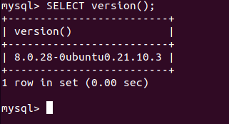
### DB erstellen/löschen 
Mit dem Nachfolgenden Befehl habe ich mich mir die Verison des DBMS angezeigt:
```sql
create database test; # Create Database
show databases; # Prüfen ob DB erstellt wurde mit anzeigen
use test; # DB test verwenden
drop database test; # DP Test löschen
show databases; # Gucken ob noch da
```
Output:                                       
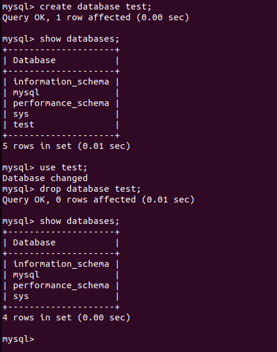
## Dienste
### Handling
```shell
# mysql starten
sudo systemctl start mysql
# mysql stoppen
sudo systemctl stop mysql
# mysql config neu laden
sudo systemctl reload mysql
# mysql neu starten
sudo systemctl restart mysql
# mysql status abfragen
sudo systemctl status mysql
# Dienst anzeigen
sudo systemctl --type=service # Alle
sudo systemctl --type=service --state=active # Nur aktive, muss nicht zwingend laufen
sudo systemctl --type=service --state=runnning # Nur laufende
```
### Autostart von MySQL
```shell
sudo systemctl enable mysql.service # Aktiviert
sudo systemctl disable mysql.service #Deaktiviert
```