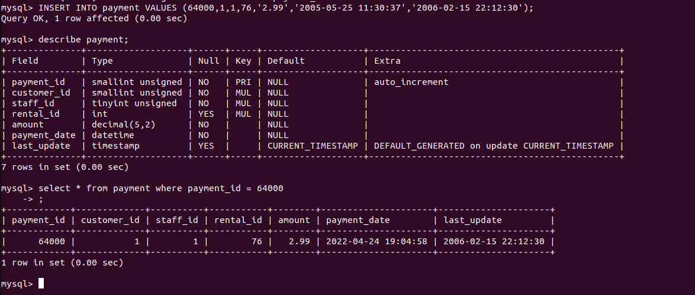
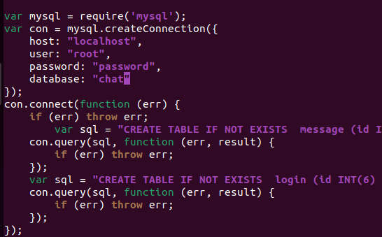

# Stored Procedures, Views und Triggers
## Sakila
### Installation und Überblick
```shell
# Import
mysql -u root -ppassword < sakila-schema.sql
mysql -u root -ppassword < sakila-data.sql
```
```sql
# Überblick
show full tables;
```
Output:                  
                  
### SPs, Views, Triggers anzeigen
```sql
# Views anzeigen
show full tables where table_type = 'VIEW';
# Stored Procedures anzeigen
SHOW PROCEDURE STATUS WHERE db = 'sakila';
# Triggers anzeigen
show triggers in sakila;
```
Output:
```
mysql> show full tables where table_type = 'VIEW';
+----------------------------+------------+
| Tables_in_sakila           | Table_type |
+----------------------------+------------+
| actor_info                 | VIEW       |
| customer_list              | VIEW       |
| film_list                  | VIEW       |
| nicer_but_slower_film_list | VIEW       |
| sales_by_film_category     | VIEW       |
| sales_by_store             | VIEW       |
| staff_list                 | VIEW       |
+----------------------------+------------+
7 rows in set (0.00 sec)

mysql> SHOW PROCEDURE STATUS WHERE db = 'sakila';
+--------+-------------------+-----------+----------------+---------------------+---------------------+---------------+--------------------------------------------------+----------------------+----------------------+--------------------+
| Db     | Name              | Type      | Definer        | Modified            | Created             | Security_type | Comment                                          | character_set_client | collation_connection | Database Collation |
+--------+-------------------+-----------+----------------+---------------------+---------------------+---------------+--------------------------------------------------+----------------------+----------------------+--------------------+
| sakila | film_in_stock     | PROCEDURE | root@localhost | 2022-04-24 18:27:55 | 2022-04-24 18:27:55 | DEFINER       |                                                  | utf8mb4              | utf8mb4_0900_ai_ci   | utf8mb4_0900_ai_ci |
| sakila | film_not_in_stock | PROCEDURE | root@localhost | 2022-04-24 18:27:55 | 2022-04-24 18:27:55 | DEFINER       |                                                  | utf8mb4              | utf8mb4_0900_ai_ci   | utf8mb4_0900_ai_ci |
| sakila | rewards_report    | PROCEDURE | root@localhost | 2022-04-24 18:27:55 | 2022-04-24 18:27:55 | DEFINER       | Provides a customizable report on best customers | utf8mb4              | utf8mb4_0900_ai_ci   | utf8mb4_0900_ai_ci |
+--------+-------------------+-----------+----------------+---------------------+---------------------+---------------+--------------------------------------------------+----------------------+----------------------+--------------------+
3 rows in set (0.00 sec)

mysql> show triggers in sakila;
+----------------------+--------+----------+------------------------------------------------------------------------------------------------------------------------------------------------------------------------------------------------------------------------------------------------------------------------------------------------------------------------+--------+------------------------+----------------------------------------------------------------------------------------------------------------------------------+----------------+----------------------+----------------------+--------------------+
| Trigger              | Event  | Table    | Statement                                                                                                                                                                                                                                                                                                              | Timing | Created                | sql_mode                                                                                                                         | Definer        | character_set_client | collation_connection | Database Collation |
+----------------------+--------+----------+------------------------------------------------------------------------------------------------------------------------------------------------------------------------------------------------------------------------------------------------------------------------------------------------------------------------+--------+------------------------+----------------------------------------------------------------------------------------------------------------------------------+----------------+----------------------+----------------------+--------------------+
| customer_create_date | INSERT | customer | SET NEW.create_date = NOW()                                                                                                                                                                                                                                                                                            | BEFORE | 2022-04-24 18:28:06.08 | STRICT_TRANS_TABLES,STRICT_ALL_TABLES,NO_ZERO_IN_DATE,NO_ZERO_DATE,ERROR_FOR_DIVISION_BY_ZERO,TRADITIONAL,NO_ENGINE_SUBSTITUTION | root@localhost | utf8mb4              | utf8mb4_0900_ai_ci   | utf8mb4_0900_ai_ci |
| ins_film             | INSERT | film     | BEGIN
    INSERT INTO film_text (film_id, title, description)
        VALUES (new.film_id, new.title, new.description);
  END                                                                                                                                                                                          | AFTER  | 2022-04-24 18:27:55.61 | STRICT_TRANS_TABLES,STRICT_ALL_TABLES,NO_ZERO_IN_DATE,NO_ZERO_DATE,ERROR_FOR_DIVISION_BY_ZERO,TRADITIONAL,NO_ENGINE_SUBSTITUTION | root@localhost | utf8mb4              | utf8mb4_0900_ai_ci   | utf8mb4_0900_ai_ci |
| upd_film             | UPDATE | film     | BEGIN
    IF (old.title != new.title) OR (old.description != new.description) OR (old.film_id != new.film_id)
    THEN
        UPDATE film_text
            SET title=new.title,
                description=new.description,
                film_id=new.film_id
        WHERE film_id=old.film_id;
    END IF;
  END | AFTER  | 2022-04-24 18:27:55.61 | STRICT_TRANS_TABLES,STRICT_ALL_TABLES,NO_ZERO_IN_DATE,NO_ZERO_DATE,ERROR_FOR_DIVISION_BY_ZERO,TRADITIONAL,NO_ENGINE_SUBSTITUTION | root@localhost | utf8mb4              | utf8mb4_0900_ai_ci   | utf8mb4_0900_ai_ci |
| del_film             | DELETE | film     | BEGIN
    DELETE FROM film_text WHERE film_id = old.film_id;
  END                                                                                                                                                                                                                                                     | AFTER  | 2022-04-24 18:27:55.62 | STRICT_TRANS_TABLES,STRICT_ALL_TABLES,NO_ZERO_IN_DATE,NO_ZERO_DATE,ERROR_FOR_DIVISION_BY_ZERO,TRADITIONAL,NO_ENGINE_SUBSTITUTION | root@localhost | utf8mb4              | utf8mb4_0900_ai_ci   | utf8mb4_0900_ai_ci |
| payment_date         | INSERT | payment  | SET NEW.payment_date = NOW()                                                                                                                                                                                                                                                                                           | BEFORE | 2022-04-24 18:28:06.61 | STRICT_TRANS_TABLES,STRICT_ALL_TABLES,NO_ZERO_IN_DATE,NO_ZERO_DATE,ERROR_FOR_DIVISION_BY_ZERO,TRADITIONAL,NO_ENGINE_SUBSTITUTION | root@localhost | utf8mb4              | utf8mb4_0900_ai_ci   | utf8mb4_0900_ai_ci |
| rental_date          | INSERT | rental   | SET NEW.rental_date = NOW()                                                                                                                                                                                                                                                                                            | BEFORE | 2022-04-24 18:28:06.95 | STRICT_TRANS_TABLES,STRICT_ALL_TABLES,NO_ZERO_IN_DATE,NO_ZERO_DATE,ERROR_FOR_DIVISION_BY_ZERO,TRADITIONAL,NO_ENGINE_SUBSTITUTION | root@localhost | utf8mb4              | utf8mb4_0900_ai_ci   | utf8mb4_0900_ai_ci |
+----------------------+--------+----------+------------------------------------------------------------------------------------------------------------------------------------------------------------------------------------------------------------------------------------------------------------------------------------------------------------------------+--------+------------------------+----------------------------------------------------------------------------------------------------------------------------------+----------------+----------------------+----------------------+--------------------+
6 rows in set (0.01 sec)

mysql> 
```
### SP und Views anwenden
#### SP
Diese SP sucht nach Filmkopien eines bestimmten filmes welche noch lager sind.
Parameter:
* p_film_id : Die ID des gesuchten Films 
* p_store_id : Die ID des entsprechenden Lagers 
* p_film_count : Die Anzahl der Filme

Return Values: Eine Tabelle mit inventory_id nummern wird generiert. In @count werden die Anzahl gefundener IDs angezeigt
```sql
CALL film_in_stock(1,1,@count);
SELECT @count;
```
Output:                     
      
#### Views
Wird verwendet, um alle Schauspieler afzulisten, inklusive der Filme in denen Sie mitgewirkt haben zusätzlich noch mit Infos zu Filkategorie
```sql
SELECT * from actor_info;
```
Output:                     
   
#### Trigger
Triggers werden immer automatisch ausgelöst nach einen Ereigniss (Input, Update, Delete) siehe Output weiter oben. Hier wurde ein Insert auf Pyment gemacht und Payment Date wurde auf Heute gesetzt, automatisch:                   
                      
### Erstellen
#### SP
```sql
# Muss geändert werden, damit der Befehl gespeichert werden kann mti ;
DELIMITER $$

CREATE PROCEDURE film_in_stock(IN p_film_id INT, IN p_store_id INT, OUT p_film_count INT)
READS SQL DATA
BEGIN
     SELECT inventory_id
     FROM inventory
     WHERE film_id = p_film_id
     AND store_id = p_store_id
     AND inventory_in_stock(inventory_id);

     SELECT COUNT(*)
     FROM inventory
     WHERE film_id = p_film_id
     AND store_id = p_store_id
     AND inventory_in_stock(inventory_id)
     INTO p_film_count;
END $$

DELIMITER ;
```
#### View
```sql
CREATE VIEW film_list
AS
SELECT film.film_id AS FID, film.title AS title, film.description AS description, category.name AS category, film.rental_rate AS price,
	film.length AS length, film.rating AS rating, GROUP_CONCAT(CONCAT(actor.first_name, _utf8mb4' ', actor.last_name) SEPARATOR ', ') AS actors
FROM category LEFT JOIN film_category ON category.category_id = film_category.category_id LEFT JOIN film ON film_category.film_id = film.film_id
        JOIN film_actor ON film.film_id = film_actor.film_id
	JOIN actor ON film_actor.actor_id = actor.actor_id
GROUP BY film.film_id, category.name;
```
#### Trigger
```sql
# Für jeden neuen Eintrag wird das Payment Date auf jetzt gesetzt
CREATE TRIGGER payment_date BEFORE INSERT ON payment
	FOR EACH ROW SET NEW.payment_date = NOW();
```
## Chat App
### Installation
#### von Git
```shell
lionel@lionel-virtual-machine:~$ git clone https://github.com/psachan190/realtime-chat-application-using-nodejs-expressjs-and-web-socket.git
Cloning into 'realtime-chat-application-using-nodejs-expressjs-and-web-socket'...
remote: Enumerating objects: 5367, done.
remote: Counting objects: 100% (3/3), done.
remote: Compressing objects: 100% (3/3), done.
remote: Total 5367 (delta 0), reused 0 (delta 0), pack-reused 5364
Receiving objects: 100% (5367/5367), 8.80 MiB | 5.75 MiB/s, done.
Resolving deltas: 100% (1373/1373), done.
lionel@lionel-virtual-machine:~$ cd realtime-chat-application-using-nodejs-expressjs-and-web-socket/
lionel@lionel-virtual-machine:~/realtime-chat-application-using-nodejs-expressjs-and-web-socket$ npm install
npm WARN chat_app@1.0.0 No repository field.

audited 135 packages in 1.007s
found 13 vulnerabilities (8 moderate, 4 high, 1 critical)
  run `npm audit fix` to fix them, or `npm audit` for details
lionel@lionel-virtual-machine:~/realtime-chat-application-using-nodejs-expressjs-and-web-socket$ 
```
#### Datenbank erstellen
```sql
CREATE DATABASE chat;
```
               
#### db.js
```shell
nano database/db.js 
```
        
#### Run
```shell 
node server.js
```

#### DB Logins
      
### Testing
             
### Anpassungen
#### Vorher
```js
var sql = "INSERT INTO message (message , user) VALUES ('" + data+ "' , '"+user+"')";
var sql = "SELECT * FROM message ";
var sql = "SELECT * FROM login WHERE username='" + username+"'";
```
#### Erstellen auf der DB
```sql
DELIMITER $$
CREATE PROCEDURE login_where(IN uname varchar(250)) READS SQL DATA BEGIN SELECT * FROM login where username = uname; END $$
CREATE PROCEDURE im(IN d varchar(2550), IN u varchar(250)) MODIFIES SQL DATA BEGIN INSERT INTO message(message, user) VALUES (d, u); END $$
DELIMITER ;
create view message_list AS SELECT * FROM message; 
```
                        
#### Nachher
```js
var sql = "call im('" + data+ "' , '"+user+"')";
var sql = "call login_where("+username+")";
var sql = "SELECT * FROM message_list";
```
       